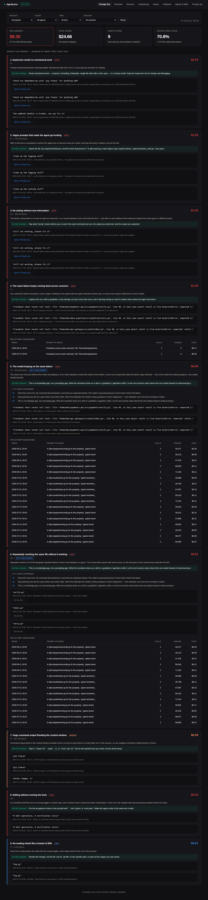
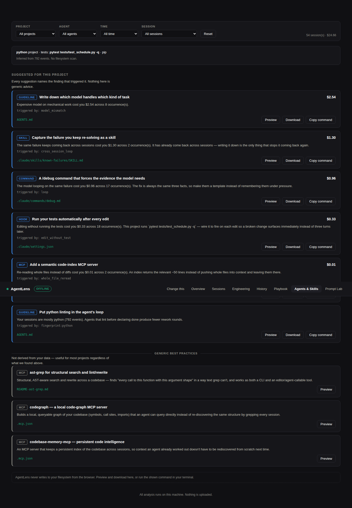
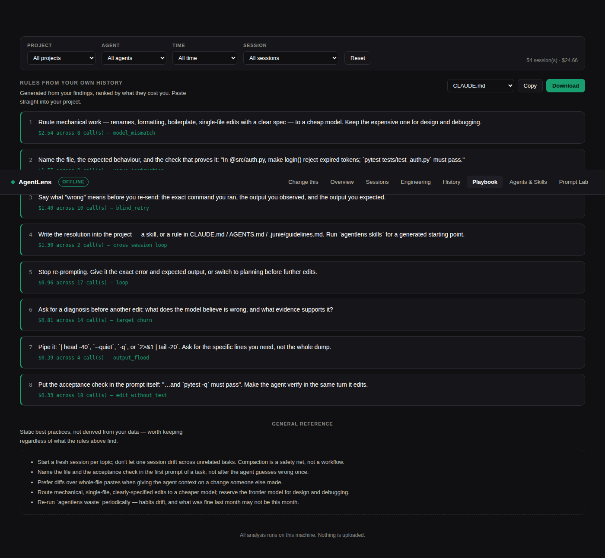
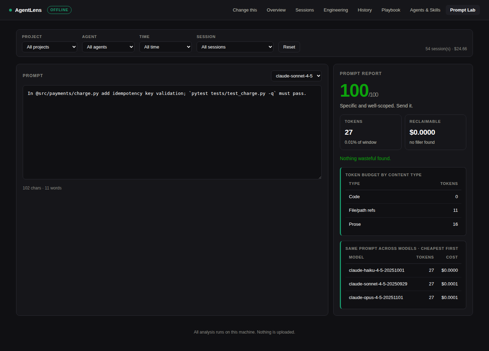
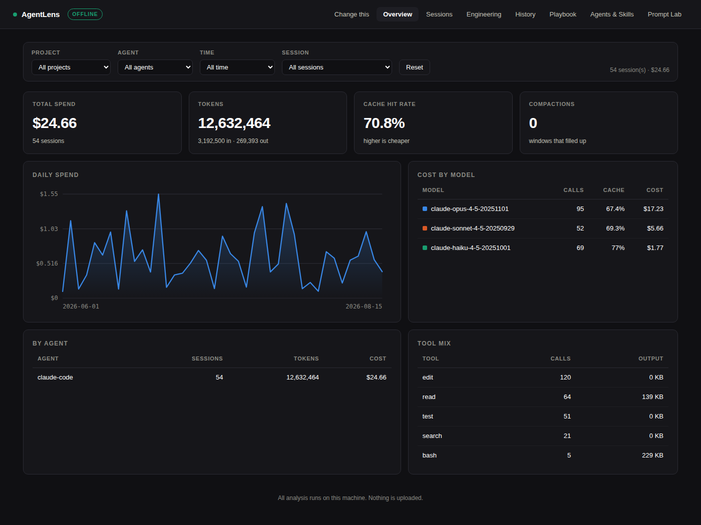
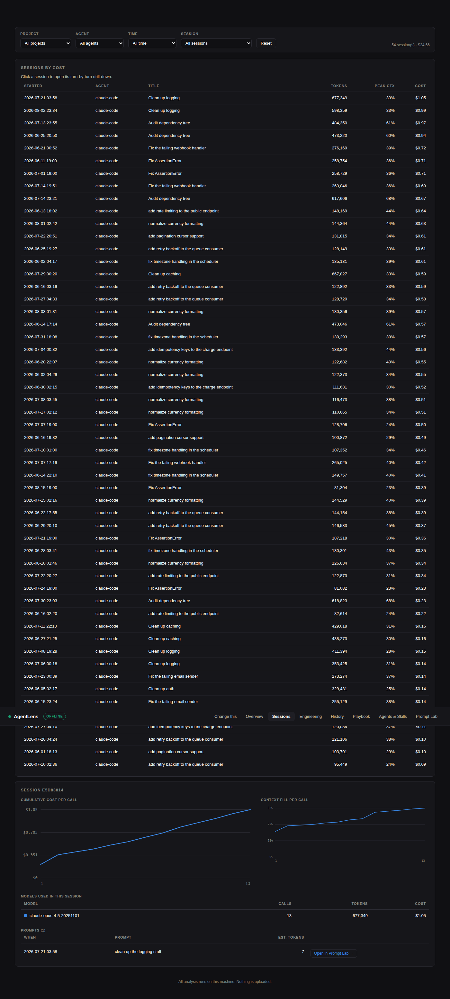
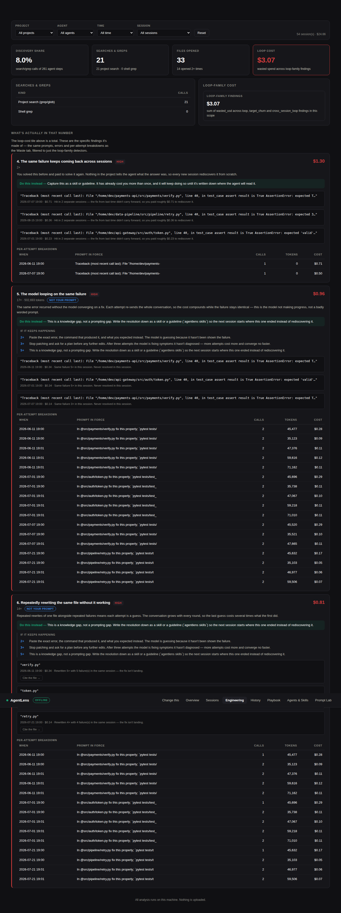
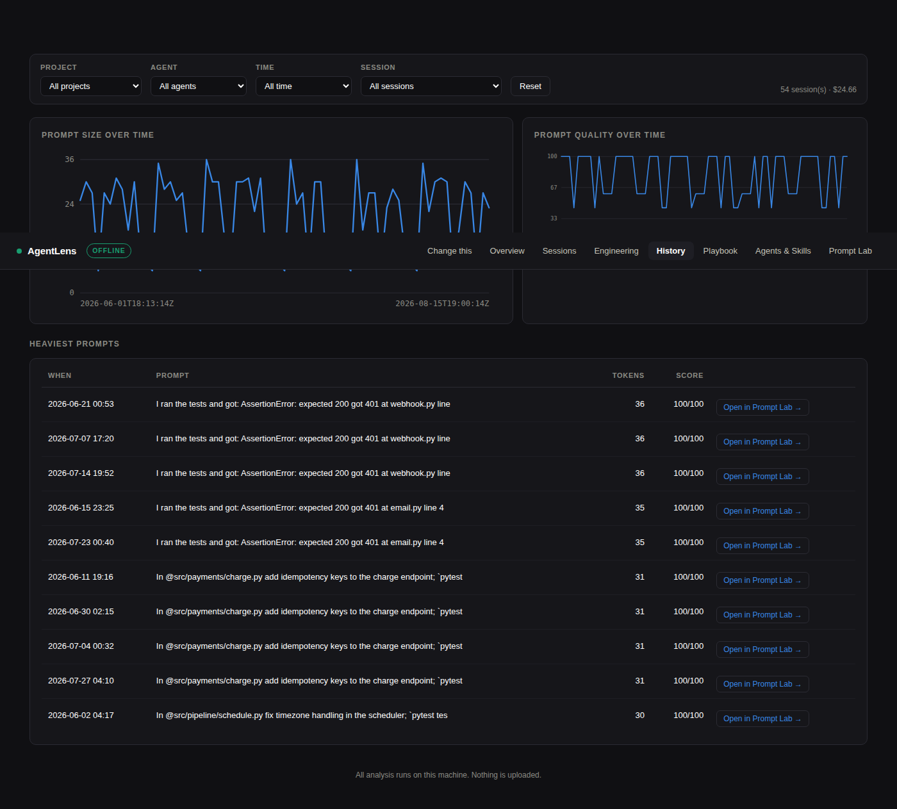

<div align="center">

# AgentLens

**Your coding agent costs more than it should. AgentLens tells you why —
from your own session history, entirely offline.**

[](https://github.com/jalpesh/AgentLens/actions)
[](https://pypi.org/project/agentlens-cli/)
[](https://pypi.org/project/agentlens-cli/)
[](LICENSE)

`Claude Code` · `Codex CLI` · `Junie` · `OpenCode` · `Gemini CLI` · `Copilot CLI` · `Goose` — one lens

</div>

---

There are already good tools that tell you **how much** your coding agent cost.
This one tells you **why**, and what to type differently tomorrow.

```console
$ agentlens waste

╭─────────────────── Change this ───────────────────╮
│ $1.38 of $3.09 (45%) traced to habits you repeat. │
│ Across 5 session(s). Ranked by what it costs you. │
╰───────────────────────────────────────────────────╯

1. Re-asking without new information  $0.15  ·  2×  ·  35,100 tokens
   Why it costs: The whole conversation is re-sent as input on every turn, so a
   second attempt costs more than the first — and with no new evidence the model
   just repeats the same guess in different words.
   → Say what "wrong" means before you re-send: the exact command you ran, the
     output you observed, and the output you expected.

     "still not working, please fix it"
       2026-08-04 09:30 · $0.10 · Reports failure without saying what failed
       ("the webhook handler is broken, can you fix it") — no error text, path
       or output was supplied.

2. Huge command output flooding the context window  $0.16  ·  1×  ·  174,024 tokens
   → Pipe it: `| head -40`, `--quiet`, `-q`. Ask for the lines you need.

     "npm ls --all"
       2026-08-05 10:30 · $0.16 · 113 KB of output (~29,004 tokens)
       re-sent as input on 6 later turns.
```

Every finding quotes **your own prompt**, attaches **a dollar figure**, and gives
**one concrete rewrite**. That is the whole design brief.

<details>
<summary><b>Screenshots</b> (synthetic data — <code>fixtures/generate.py</code>, not anyone's real history)</summary>

<br>

**Change this** — the reason this tool exists. Note the filter row, "not your
prompt" on findings that are the model's fault, and the per-attempt breakdown
under loop/churn findings:


**Agents & Skills** — triggered suggestions on top (every one names the
finding behind it), a visibly separate "generic best practices" bucket below:


**Playbook** — personalised rules on top, generic reference clearly separated below:


**Prompt Lab** — opened from a finding, with the rewrite filled from that
session's real file and error, plus the token budget by content type and the
same prompt re-priced across every model in your history:


**Overview** — the table-stakes cost charts every competitor also has:


**Sessions** — click a row for the turn-by-turn drill-down: cumulative cost
and context-fill per call, the per-session model table, and every prompt with
an "Open in Prompt Lab" link:


**Engineering** — discovery share, searches & greps, files opened, and
loop-family cost, rolled up from the same events, no new detector:


**History** — prompt size and quality over time, plus the heaviest prompts
you've sent:


</details>

## Install

```bash
uvx agentlens-cli doctor        # zero-install, see what it finds
# or
pipx install agentlens-cli
```

Python 3.10+. One dependency (`rich`). No Node, no Docker, no account, no API key.

### Running from source

If you cloned the repo instead of installing the published package, skip the
manual venv/pip dance and use the bundled runner — it creates the venv,
installs everything, ingests your local history and starts the dashboard:

```bash
git clone https://github.com/jalpesh/AgentLens.git && cd AgentLens
./run.sh                  # setup + ingest + start, all in one
```

`run.sh` always uses `python3` explicitly (never bare `python`), is safe to
re-run (it won't reinstall an already-good venv or start a second server on
top of one it already started), and has explicit subcommands too:

```bash
./run.sh setup            # create .venv, install agentlens-cli + dev deps
./run.sh ingest [args]     # parse local agent history into the local db
./run.sh start [--port N]  # start the dashboard (default port 7878)
./run.sh stop              # stop the dashboard, if this script started it
./run.sh restart           # stop, then start
./run.sh status            # is a server running, and on what port/pid
./run.sh test              # ruff + pytest
```

## Use

```bash
agentlens doctor            # which agents are on this machine
agentlens ingest            # parse local history into a local SQLite db
agentlens waste             # why it was expensive, with evidence   ← the point
agentlens skills            # hooks/skills/commands to fix what it found
agentlens playbook          # ranked, paste-ready rules generated from YOUR findings
agentlens report            # cost and token summary
agentlens report --html out.html   # same dashboard, one file, no server — share it
agentlens projects          # list projects available to --project
agentlens sessions          # per-session breakdown
agentlens lab "..."         # score a prompt BEFORE you send it
agentlens serve             # live dashboard on http://127.0.0.1:7878
agentlens export            # redacted JSON for your own analysis
```

Every reporting command takes the same filters:

```bash
agentlens waste --project payments-api      # one project (name or id; prefixes work)
agentlens waste --provider claude-code      # one agent
agentlens waste --days 30                   # one time window
agentlens waste --session <id>              # one session
```

### Prompt Lab

Score a prompt before you spend anything on it. Local tokenizer, no API call.

```console
$ agentlens lab "fix the auth stuff, maybe clean it up if possible. thanks!"

╭──────────────────── Prompt report ─────────────────────╮
│ 33/100   Rewrite this. As written it will cost several │
│          turns to converge.                            │
│ 17 tokens · 0.01% of 200,000 window · $0.0001 to send  │
╰────────────────────────────────────────────────────────╯

  −22  No file or path referenced
       → Name the file with @path/to/file. Without it the agent greps your
         repo to find out what you meant, and that search is billed to you.
  −18  No acceptance check
       → State what "done" looks like — "`pytest -q` must pass".
  −15  Opens with a vague instruction   found: "fix"
  −12  Hedging language (3×)            found: "if possible, maybe, try to"
```

A scorer that never says no is decoration. This one is opinionated enough to
occasionally annoy you — that is the feature.

### Playbook: detect → prescribe → **install the fix**

Every finding already carries a rewrite. The Playbook turns the ones that
actually cost you money into a ranked, paste-ready rules file — closing the
loop most tools leave open.

```bash
agentlens playbook --format claude --out CLAUDE.md
agentlens playbook --format agents --out AGENTS.md
agentlens playbook --format junie  --out .junie/guidelines.md
```

Two sections, always kept visually and structurally separate:

- **Rules from your own history** — generated from your findings, ranked by
  dollar evidence, capped at 8 (a 30-rule guidelines file is itself the kind
  of bloat this tool exists to catch).
- **General reference** — static best practices anyone could write. Useful,
  but it has no data behind it, so it renders clearly secondary in the CLI,
  the dashboard, and every exported file.

### Loops: when it isn't your prompt

Every other detector here identifies something *you* did. This one identifies
something the **model** did — the same failure, over and over, without
converging — and says so.

```console
3. The model looping on the same failure  $0.22 · 8× · 135,800 tokens · not your prompt
   Why it costs: The same error recurred without the model converging on a fix.
   Each attempt re-sends the whole conversation, so the cost compounds while the
   failure stays identical — this is the model not making progress, not a badly
   worded prompt.
     If it keeps happening:
       ▸ 2+ → Paste the exact error, the command, and what you expected instead.
       ▸ 3+ → Stop patching. Ask for a plan before any further edits.
       ▸ 5+ → This is a knowledge gap, not a prompting gap. Write it down as a skill.
```

Failures are fingerprinted into a **signature** — the error with line numbers,
paths, addresses and timings stripped out — so two occurrences of the same
underlying problem match even though their raw text differs. Three of one
signature means the model is circling.

**The suppression that keeps it honest:** iteration that *ends in success* is
just debugging, and is silenced. A detector that fires on every productive
fix-it session would make the whole report worthless, so the converged case has
its own fixture and its own test.

A tool willing to tell you when something *isn't* your fault is more believable
when it says it is.

**Per-attempt breakdown.** A loop/churn finding no longer stops at "5×,
$0.22" — expand it and see every attempt: the prompt in force, calls, tokens,
and cost, in order, so you can see the conversation growing turn over turn
rather than just the total.

**Loop citations.** When a loop finding's evidence names a specific file, the
dashboard offers a collapsed "Cite the file →" drill-down. This is the one
place in AgentLens that reads file *content* off disk rather than session-log
metadata — narrow, opt-in per click, never cached, and it degrades to "file
not available locally" rather than crashing when the repo has moved or you're
reviewing history on a different machine. See the "Loop citations" section in
[SECURITY.md](SECURITY.md) for the exact contract.

### Session drill-down

Sessions used to show totals only. Click one in the Sessions tab and it opens
into the turn-by-turn story: cumulative cost per call, context-window fill per
call, a per-session model table, and the full prompt list — each prompt wired
to the same "Open in Prompt Lab" flow the Waste tab uses, so you can re-score
a prompt from three weeks ago without hunting for the original text.

### Agents & Skills: fix it, don't just read about it

`agentlens skills` turns findings into files you can actually install — a hook,
a slash command, a skill, an MCP config, a guideline.

```console
$ agentlens skills

╭──────────────── Detected project ────────────────╮
│ python project · tests: pytest tests/test_x.py -q │
│ Inferred from 190 events. No filesystem scan.     │
╰───────────────────────────────────────────────────╯

post-edit-tests  [hook]  Run your tests automatically after every edit  $0.52
   Editing without running the tests cost you $0.52 across 23 occurrence(s).
   triggered by: edit_without_test
   → .claude/settings.json

$ agentlens skills --init post-edit-tests            # preview
$ agentlens skills --init post-edit-tests --write    # write it
```

Two rules make this different from a list of tool recommendations:

**No suggestion without a triggering finding or a detected fact.** Every entry
names its trigger. "Here are ten good MCP servers" is content anyone can write;
"add this hook, because `edit_without_test` cost you $0.52 across 23 edits" can
only come from something that read your history.

**No package named that hasn't been verified to exist.** Where a category is
right but no specific implementation has been confirmed, AgentLens says so and
emits a config stub rather than inventing a plausible-sounding package. A
recommendation for software that doesn't exist is the same credibility failure
as claiming support for a log format you never tested.

The project profile is inferred **from your session history, not a filesystem
scan** — file extensions the agent touched, commands it ran, manifests it
opened. It works on a machine where the project is no longer checked out, and
it describes what your agent actually did rather than what a config file claims.

Below the triggered list sits a second, visually distinct section: **"Generic
best practices — not derived from your data."** Three tools verified to
actually exist (`ast-grep` for structural search, `codegraph` for a local
code-graph MCP server, `codebase-memory-mcp` for persistent code memory),
shown the same way every time regardless of what your history contains. It
never sets a `triggered_by` — that would be claiming a receipt this section
doesn't have — and it never replaces the triggered list, only sits alongside
it under its own heading. (One evaluated, ambiguous package —
`code-review-graph`, which resolves to at least four unrelated projects with
no canonical implementation — was left out rather than guessed at; see
`PLAN_PHASE4.md`.)

> **The dashboard never writes to your filesystem.** It previews, downloads, and
> copies the CLI command. There is exactly one POST endpoint in the whole server
> (`/api/lab`, the prompt scorer) and no file-write endpoint at any flag or
> setting — a browser-reachable arbitrary-write endpoint isn't something a
> privacy-positioned tool should ship to save a copy-paste.

## What it detects

| Habit | What it looks for | Typical fix |
|---|---|---|
| **Loop** ★ | The *same failure* 3+ times in a session without converging | Escalates: better prompt → plan mode → write a skill |
| **Cross-session loop** ★ | The same failure recurring in *different* sessions | Write it down — the knowledge isn't persisting |
| **Target churn** ★ | One file rewritten 4+ times with failures in between | Ask for a diagnosis before another edit |
| **Blind retry** | Follow-up prompt reporting failure with no error text, path or output | Say what "wrong" means |
| **Output flood** | Huge tool output re-sent as input on every later turn | Pipe through `head`/`-q` |
| **Vague instruction** | No file reference, no acceptance criterion, agent has to go hunting | Name file + acceptance check |
| **Edit without test** | Many edits, few verification runs | Put the check in the prompt |
| **Whole-file re-read** | Same file read 3+ times in one session | Review the diff, not the file |
| **Compaction thrash** | Session runs until the window fills | Start fresh when the topic changes |
| **Uncached docs** | Same URL fetched repeatedly | Cache it in `CLAUDE.md`/`AGENTS.md` |
| **Model mismatch** | Frontier model on mechanical work | Route mechanical work to a cheap model |

Each is one small file in [`analytics/detectors/`](src/agentlens/analytics/detectors/)
with its own test. Adding one is a pull request, not a redesign.

## Supported agents

| Agent | Source | Status |
|---|---|---|
| **Claude Code** | `~/.claude/projects/**/*.jsonl` | ✅ full — usage, cache split, tools, compaction |
| **Codex CLI** | `$CODEX_HOME/{sessions,archived_sessions}` | ✅ full — cumulative counters resolved to deltas |
| **Junie** | `~/.junie/history.json` | ✅ full |
| **OpenCode** | `~/.local/share/opencode/storage/message/**/*.json` | ✅ full — one JSON file per message, documented layout |
| **Gemini CLI** | `~/.gemini/tmp/<project-hash>/chats/` | ⚠️ experimental — location confirmed by Google's docs, on-disk *format* isn't, so this tolerates several plausible shapes |
| **GitHub Copilot CLI** | `~/.copilot/session-store.db` | ⚠️ experimental — undocumented SQLite; parses via schema introspection, included anyway for its install base |
| **Goose** | `~/.local/share/goose/sessions/sessions.db` (≥1.10) or `*.jsonl` (<1.10) | ⚠️ experimental — vendor changed formats between versions; both are handled |
| Cursor · Windsurf | Multiple undocumented SQLite stores | 🔜 Phase 3 |

**What "⚠️ experimental" means in practice:** the on-disk schema isn't
published, so these adapters introspect column/key names at read time instead
of hardcoding a query — the same approach Junie's adapter uses for its
history-key drift, just applied to a database instead of a JSON key. `agentlens
doctor` labels these explicitly and tells you if a root exists but nothing
readable was found in it. If it finds nothing on your install, that's the
honest failure mode for an unverified format — please open an issue with
`PRAGMA table_info(<table>)` output (no real data needed) rather than a bug
report; that feedback is exactly how Claude Code and Codex went from
experimental to full.

Adding an agent means implementing one interface — `discover()`, `detect()`,
`parse()` — and committing a synthetic fixture. Nothing else in the codebase
changes. See [`adapters/base.py`](src/agentlens/adapters/base.py).

### Cross-platform by construction

AgentLens is a plain local process — no elevated privileges, no bundled
runtime. It relies on ordinary OS file permissions, which differ enough across
platforms that a flat "permission denied" isn't actionable on its own, so
`agentlens doctor` prints OS-specific guidance instead: macOS sandboxed-terminal
/ Full Disk Access hints, Windows Controlled Folder Access hints, and a plain
`chmod` hint on Linux. A directory that exists but can't be listed is reported
as "found, 0 readable" rather than silently counted as "not installed."

## Privacy

This reads your session history, which contains repo paths, hostnames, client
names and occasionally credentials. So:

- **Nothing leaves your machine by default.** No telemetry, no phone-home, no
  account. The dashboard binds to `127.0.0.1` and the default install works
  with the network off.
- **One opt-in exception, stated plainly:** `agentlens lab --llm` sends the
  prompt you're editing to Anthropic or OpenAI for a rewrite. It requires the
  flag *and* your own API key, it is never automatic, and without it the
  rewrite is generated locally. See [SECURITY.md](SECURITY.md) for the exact
  boundary.
- **The dashboard cannot write files.** Skill/hook generation previews and
  downloads in the browser; only the CLI writes to disk.
- **Project names are basenames, never paths.** `checkout-service`, not
  `/Users/you/work/AcmeCorp/checkout-service` — enough for a filter, not enough
  to leak your employer. Stripped entirely from exports.
- **Repo paths are salted hashes**, never stored as paths.
- **`export` and `report --html` redact by default** — URLs, home directories,
  emails, IPs. Secrets are stripped even with `--raw`.
- **The static HTML export is a single self-contained file** with the data
  baked in — no server, no fetch, verified in CI to fire zero network requests
  when opened offline. Safe to attach to a Slack message or a PR.
- **Every committed fixture is synthetic**, generated by
  [`fixtures/generate.py`](fixtures/generate.py). No real session data is in
  this repository.

## Architecture

```
 ~/.claude/projects/**/*.jsonl        ─┐
 $CODEX_HOME/sessions/*.jsonl         ─┤
 ~/.junie/history.json                ─┤
 ~/.local/share/opencode/storage/     ─┼─→ [Adapter] ─→ Event[] ─→ [SQLite]
 ~/.gemini/tmp/**/chats/         ⚠️    ─┤                              │
 ~/.copilot/session-store.db     ⚠️    ─┤                              ▼
 ~/.local/share/goose/sessions/  ⚠️    ─┘         ┌────────────────────────────┐
                                                   │  cost · context · rollups  │
                                                   │  WASTE DETECTORS  ★        │
                                                   │  LOOP DETECTION   ★        │
                                                   │  prompt scorer + rewrite ★ │
                                                   │  PLAYBOOK GENERATOR  ★     │
                                                   │  SKILL/HOOK GENERATOR ★    │
                                                   └─────────────┬──────────────┘
                                                                 ▼
                                       CLI + local dashboard :7878 + static export
```

The whole design rests on one decision: **every agent reduces to the same
`Event` stream** ([`schema.py`](src/agentlens/schema.py)). Get that right and a
new agent is ~150 lines. Get it wrong and you rebuild the app per tool.

Three details that matter more than they look:

- **`event_id` is a content hash**, so re-ingesting is idempotent. Without it you
  double-count and stop trusting your own numbers.
- **Cache reads and fresh input are priced separately.** Two sessions with the
  same token total can differ several-fold in cost on cache hit rate alone.
- **Cost is always recomputed**, never read from the log — so history can be
  repriced when rates change.
- **`seq` is derived from wall-clock time, not a per-file counter**, for any
  adapter where one session spans many files (OpenCode: one JSON file per
  message). A counter that resets to 0 every process would silently reorder
  events the moment two `ingest` runs happen on separate days — the fix,
  `Adapter.seq_from_ts`, is one of the more subtle bugs this project caught on
  itself before it shipped.

## Development

```bash
git clone https://github.com/jalpesh/AgentLens.git && cd AgentLens
./run.sh setup && ./run.sh test    # venv + install + ruff + pytest, in one step
```

That's the same `[dev]` install and the same `ruff check` + `pytest -q` CI
runs — good for a quick clean-checkout sanity check. For more control
(installing manually, generating synthetic history yourself, pointing
individual adapters at a demo directory), do it by hand instead:

```bash
pip install -e ".[dev]"
python fixtures/generate.py --demo ~/agentlens-demo   # synthetic history, all 7 agents
pytest -q                                              # 144 tests

# fixtures/generate.py prints the exact export lines for your shell; e.g.:
export CLAUDE_CONFIG_DIR=~/agentlens-demo/.claude
export OPENCODE_HOME=~/agentlens-demo/.opencode
export GEMINI_HOME=~/agentlens-demo/.gemini
export COPILOT_HOME=~/agentlens-demo/.copilot
export GOOSE_HOME=~/agentlens-demo/.goose/sessions
export AGENTLENS_HOME=/tmp/agentlens-demo-db

agentlens doctor && agentlens ingest && agentlens waste
```

## Prior art

[`ccusage`](https://ccusage.com) covers cost accounting across many more agents
and does it well — if all you want is spend reporting, use it. AgentLens
deliberately supports fewer agents in order to go deeper on one question those
tools don't ask: *which of my own habits is causing this, and what do I type
instead?*

## License

MIT
